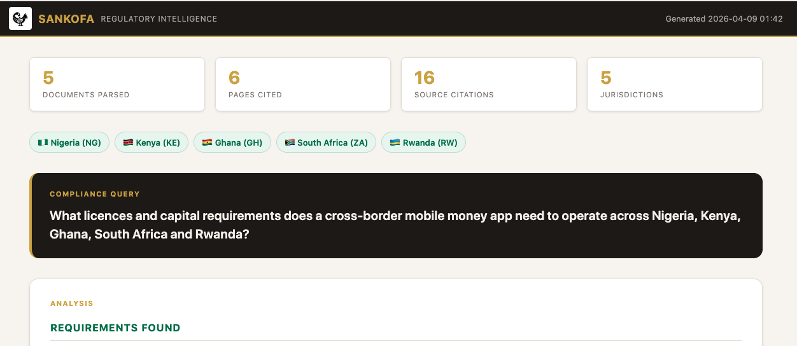

# Sankofa 🦅

> *"Go back. Fetch it. Prove it."*

A Claude Code skill — born in Ghana — that parses African regulatory documents and generates deep compliance reports with every claim cited back to the exact word on the exact source page.



## The problem

African fintechs expanding across borders must navigate 54+ different regulatory regimes. Central bank circulars, licensing frameworks, and AML guidelines live in dense PDFs. Missing one rule can mean a revoked licence. Compliance work demands an audit trail.

## What it does

1. **Parses** your folder of regulatory PDFs (BOG, CBK, CBN, SARB, BNR…) in seconds — fully local, no API key
2. **Analyses** your compliance question with Claude — finding requirements, gaps, and action items across jurisdictions
3. **Generates** a self-contained HTML report with word-level citations and bounding boxes highlighted directly on each source page image

## Install

```bash
npx skills add agbozo1/sankofa-skill --skill sankofa
```

Or clone and add the skill path manually.

## Usage

```
/sankofa ./regs "What licences does a mobile money operator need in Ghana?"
/sankofa ./regs "Our app lets users send money across Ghana, Nigeria and Kenya — what do we need?"
/sankofa ./regs "What AML rules apply to a crypto exchange in Ghana and South Africa?"
/sankofa ./regs "Compare agent banking requirements across East Africa"
```

**Arguments:**
- First: path to a directory of regulatory documents (PDF, DOCX, PPTX, XLSX, images, .txt)
- Rest: your compliance question or product description

## Output

A timestamped HTML report (`sankofa_output/sankofa-report-YYYY-MM-DD-HHmmss.html`) containing:
- **Requirements Found** — what the regulations actually say, with citations
- **Compliance Gaps** — what your product may be missing
- **Jurisdictional Summary** — per-country breakdown
- **Action Items** — numbered next steps
- **Visual citations** — each claim linked back to the highlighted word on the source PDF page

## Supported jurisdictions

Ghana (BOG) · Nigeria (CBN) · Kenya (CBK) · South Africa (SARB) · Rwanda (BNR) · Uganda (BOU) · Tanzania (BoT) · Egypt (CBE) · Senegal (BCEAO) · + any African regulatory doc

## Sample data

The `data/sample_regs/` folder includes sample regulatory documents from Ghana, Nigeria, Kenya, South Africa, and Rwanda. Try:

```
/sankofa ./data/sample_regs "What capital requirements apply to a payment service provider in Ghana?"
/sankofa ./data/sample_regs "Compare e-money licensing rules across all included jurisdictions"
```

## Requirements

```
pip install pymupdf python-docx python-pptx
```

No API key required. All libraries run fully locally.

- **PyMuPDF** — PDF parsing with word-level bounding boxes and page screenshots
- **python-docx** — DOCX text extraction
- **python-pptx** — PPTX slide text extraction

## Inspired by

[liteparse_samples](https://github.com/jerryjliu/liteparse_samples) by Jerry Liu — built the original research-docs skill this is adapted from.

---

*Sankofa is an Akan word from Ghana meaning "go back and fetch it" — the wisdom to look back at the source before moving forward. The name, the symbol, and the purpose are all Ghanaian.*
